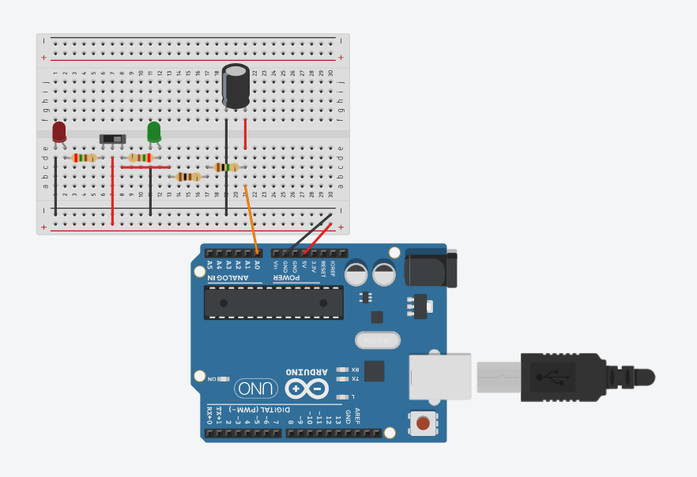
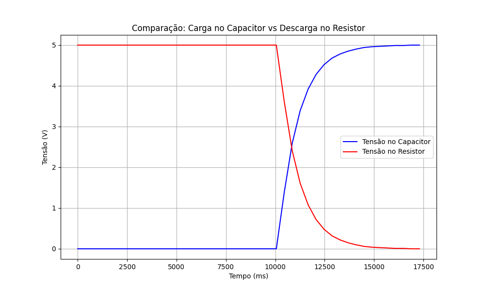

# Análise do Hardware

  
<strong>Imagem do hardware utlizado</strong>

  

 

O circuito alimenta um interruptor deslizante. Quando ele está virado para a esquerda, o LED vermelho é ligado, indicando que o sistema está parado. No entanto, quando o interruptor é deslizado para a direita, o LED verde acende, e o capacitor passa a ser carregado. Os valores da tensão do capacitor e tensão dos resistores são registrados no console.

O projeto pode ser encontrado [nesse link](https://www.tinkercad.com/things/4f1fyhS010m-terrific-gogo-kieran/editel?returnTo=https%3A%2F%2Fwww.tinkercad.com%2Fdashboard&sharecode=7LaqNECnpoLfA6MYmMz1Dvgw6yiI4-B77daq0BL4YkU).

# Análise dos gráficos

  
<strong>Gráfico de comparação</strong>

  

 

Com os gráficos, é possível concluir que, quando o interruptor permite a passagem de carga, o capacitor começa a ser carregado, aumentando sua tensão.  Ao mesmo tempo, a resistência do resistor diminui proporcionalmente, até que o capacitor esteja totalmente carregado e a tensão do resistor atinja zero.

